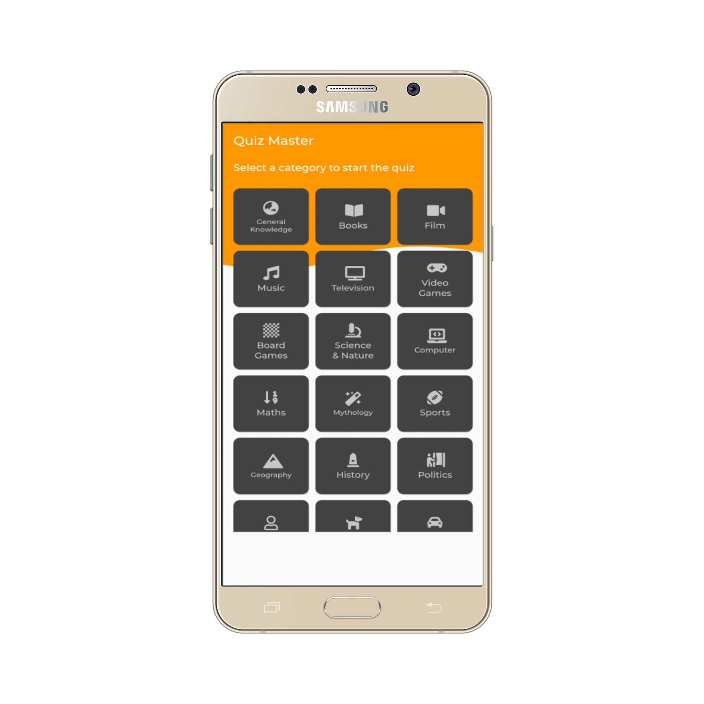
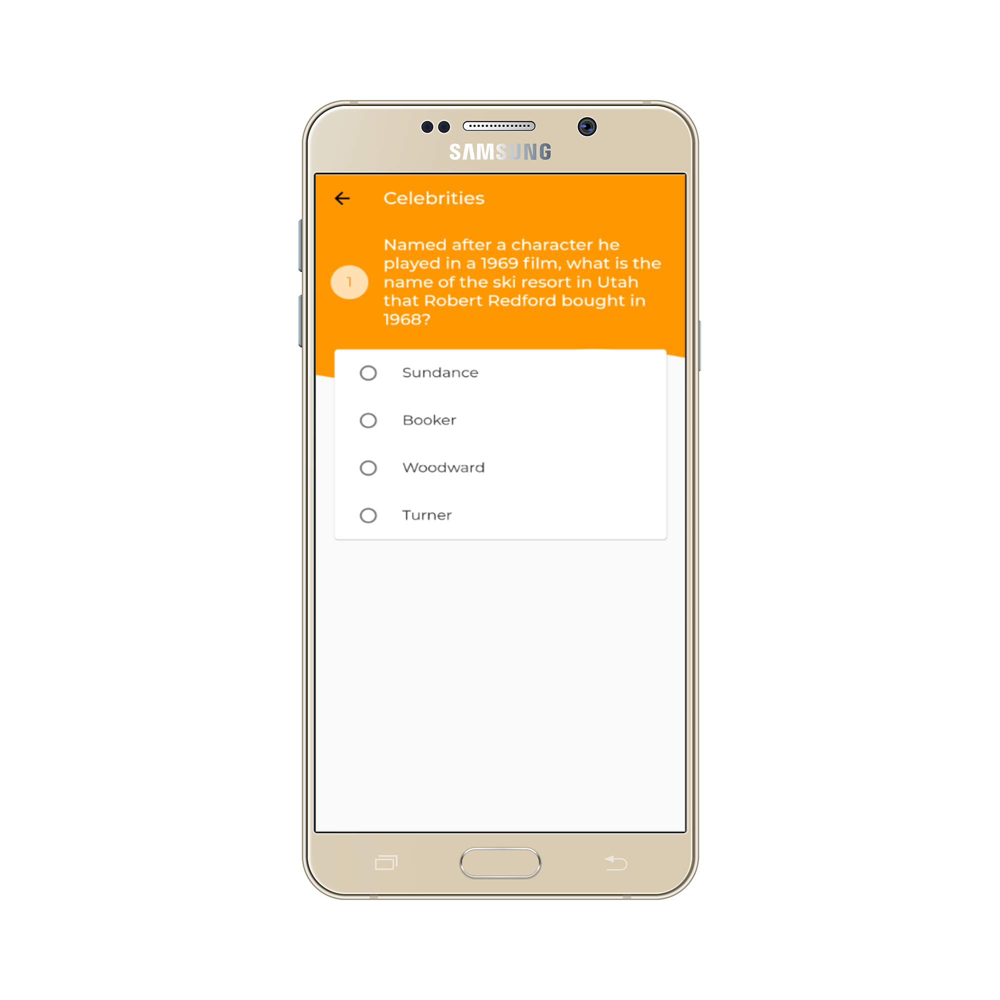

# Quiz Master 📽

	Original Source code taken from: https://github.com/lohanidamodar/flutter_opentrivia (https://www.facebook.com/lohanidamodar)

   

<h4 align="center">
 🦋 Quiz Master - Quiz with 20 categoried to play with 🚀
</h4>
 
 
 

	<table>
		<tr>
			<td style="text-align: center"></td>
			<td style="text-align: center"></td>
		</tr>
		<tr>
			<td style="text-align: center"></td>
			<td style="text-align: center"></td>
		</tr>
		<tr>
			<td style="text-align: center"></td>
			<td style="text-align: center"></td>
		</tr>
	</table>

For help getting started with Flutter, view  
[online documentation](https://flutter.io/docs), which offers tutorials,
samples, guidance on mobile development, and a full API reference.
